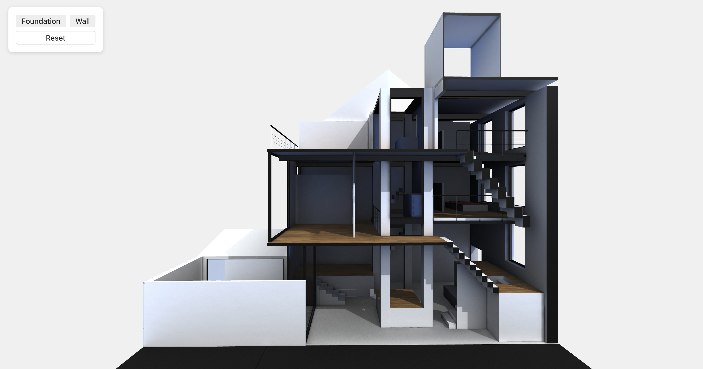

# 🏡 3D House Interactive Viewer (Three.js + React)

This is a lightweight 3D demo built with Three.js and TypeScript to showcase basic model loading and interaction capabilities.



## ✨ Features

- ✅ Loads a GLB-format 3D house model using `GLTFLoader`
- ✅ Highlights individual parts (Foundation, Wall) with a color change on button click
- ✅ Reset button to restore original colors
- ✅ Raycasting-ready structure for object-based interaction
- ✅ Built with TypeScript + React + Zustand

## 🧱 Architecture

- **GLTFLoader** loads `/models/house.glb`
- **Zustand** manages selected part state
- **Three.js** handles rendering and interaction
- **React** renders UI controls

## 📸 Demo

https://iizz.github.io/3d-house-interaction/

## 🧪 Try it

```bash
git clone https://github.com/iizz/3d-house-interaction.git
cd 3d-house-interaction
npm install
npm run dev
```
